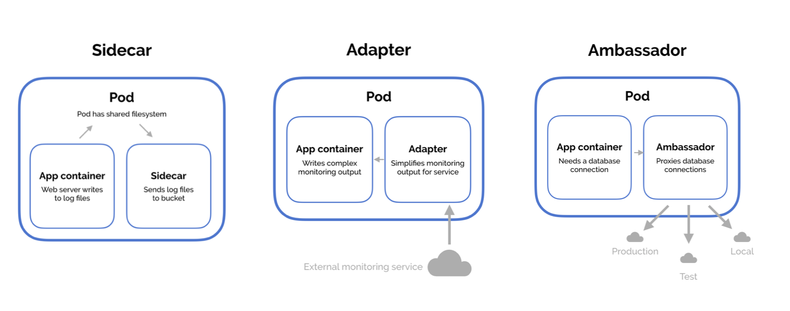

# MULTI-CONTAINER PODS

Dentro de un Pod pueden haber mútiples contenedores, no es lo habitual, pero hay casos que es necesario que dos aplicaciones "dependientes" se gestionen juntas y de ese modo, por ejemplo, compartirán volumen de datos.

```yaml
apiVersion: v1
kind: Pod
metadata:
  name: simple-webapp
spec:
  containers:
    - name: simple-webapp
      image: simple-webapp
      ports:
        - containerPort: 8080
    - name: log-agent
      image: log-agent
```

https://matthewpalmer.net/kubernetes-app-developer/articles/multi-container-pod-design-patterns.html

## **Patrones de diseño**



### **Sidecar**

Ejemplo, desplegar un log-server junto al webapp para mandar los logs a un servidor central de logs.

### **Adapter**

Si ese servidor central recibe de varias apps, seguramente el formato de logs sea diferente. El contenedor Adapter procesa los logs antes de enviarlos al servidor central para homogeneizar.

### **Ambassador**

Si la aplicación se comunica con diferentes BDs durante el desarrollo (dev, pre, pro) hay que gestionar esto. Por lo que el contenedor Ambassador hará de proxy y todas las conexiones irán a localhost y se encargará de redirigirlas a la BD pertinente.

```yaml
apiVersion: v1
kind: Pod
metadata:
  name: webapp-color
spec:
  containers:
    - name: webapp-color
      image: webapp-color
  tolerations:
    - key: "app"
      operator: "Equal"
      value: "blue"
      effect: NoSchedule
```
