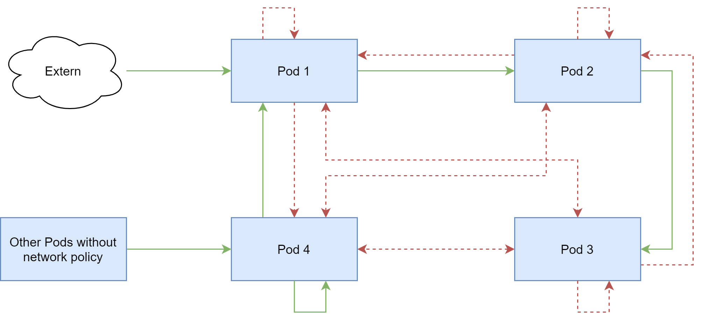

# EXAMPLE NETWORK POLICY



## **PODS**

`kubectl run nginx-1 --image=nginx`

`kubectl run nginx-2 --image=nginx`

`kubectl run nginx-3 --image=nginx`

`kubectl run nginx-4 --image=nginx`

## **SERVICES**

`kubectl expose pod nginx-1 --name=nginx-service-1 --port=80 --type=NodePort`

`kubectl expose pod nginx-2 --name=nginx-service-2 --port=80`

`kubectl expose pod nginx-3 --name=nginx-service-3 --port=80`

`kubectl expose pod nginx-4 --name=nginx-service-4 --port=80`

_Pods are automatically assigned the label `run` with the pod name. We will use it in this example as pod selectors._

## **NETWORK POLICIES**

Network policy of pod/service 1:
* Access from outside the node allowed
* it can only access to pod/service 2 via port 80
* 
```yaml
apiVersion: networking.k8s.io/v1
kind: NetworkPolicy
metadata:
  name: nginx-1-policy
spec:
  podSelector:
    matchLabels:
      run: nginx-1

  # An unconfigured policyType causes that type of traffic to be denied
  policyTypes:
  - Ingress
  - Egress

  # To allow all ingress traffic, if we set the policyType
  # It is the same as not setting the ingress policyType in this config
  ingress: 
  - {}

  egress:
  - to:
    - podSelector:
        matchLabels:
          run: nginx-2
    ports:
    - protocol: TCP
      port: 80
```

Network policy of pod/service 2:
* Access only from pod/service 1 on port 80
* It can only access pod/service 3 via port 80

```yaml
apiVersion: networking.k8s.io/v1
kind: NetworkPolicy
metadata:
  name: nginx-2-policy
spec:
  podSelector:
    matchLabels:
      run: nginx-2

  policyTypes:
  - Ingress
  - Egress

  ingress:
  - from:
    - podSelector:
        matchLabels:
          run: nginx-1
    ports:
    - protocol: TCP
      port: 80

  egress:
  - to:
    - podSelector:
        matchLabels:
          run: nginx-3
    ports:
    - protocol: TCP
      port: 80
```

Network policy of pod/service 3:
* Access only from pod/service 2 on port 80
* Cannot access to other Pods

```yaml
apiVersion: networking.k8s.io/v1
kind: NetworkPolicy
metadata:
  name: nginx-3-policy
spec:
  podSelector:
    matchLabels:
      run: nginx-3

  policyTypes:
  - Ingress
  - Egress # Egress without config denies outbound traffic

  ingress:
  - from:
    - podSelector:
        matchLabels:
          run: nginx-2
    ports:
    - protocol: TCP
      port: 80
```

## **TESTS**

1. All Pods, services and network policy are created.

2. List of services:
```
NAME                  TYPE        CLUSTER-IP       EXTERNAL-IP   PORT(S)
nginx-service-1       NodePort    10.244.172.27    <none>        80:31517/TCP
nginx-service-2       ClusterIP   10.244.247.5     <none>        80/TCP
nginx-service-3       ClusterIP   10.244.199.185   <none>        80/TCP
nginx-service-4       ClusterIP   10.244.96.152    <none>        80/TCP
```

3. Access to each of the Pods to verify traffic
   
   `kubectl exec -it nginx-1 -- /bin/bash`

4. Execution of CURLs to verify access:
   1. Pod 1: `curl 10.244.172.27`
   2. Pod 2: `curl 10.244.247.5`
   3. Pod 3: `curl 10.244.199.185`
   4. Pod 4: `curl 10.244.96.152`
